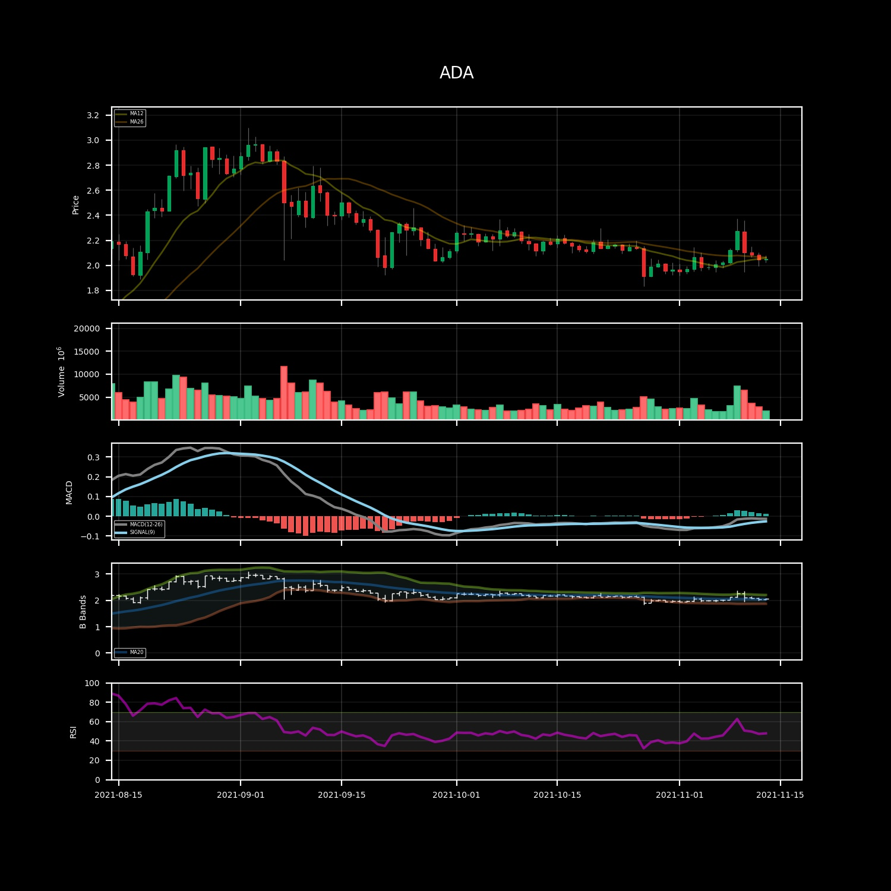

# Quick start

This repository - as of 15 November 2021 - is the source code for automated reporting of cryptocurrency prices. It uses a telegram bot (@ccrryyppttoo_bot) to send **daily updates on crypto prices**.



The coins that are actually tracked are: `BTC`,`ETH`,`ADA`,`MATIC`, `SOL`.

If you wish to get updates on the selected coins, just open a chat with the bot and start the conversation with `\start`. You will be added to the user list.

The package is used as in `main.py`.
This script is executed on a AWS ec2 istance every day at `06:30 AM UTC`.

1. The [Scraper()](/reference/scraper.rst) module gets the necesarriy data from [coinmarketcap.com](http://www.coinmarketcap.com) and stores data locally. 
2. [Tg_notifications()](/reference/telegram.rst) starts a telegram client to send outputs to bot followers.
3. [CoinFigure()](/reference/plotting.rst) Creates a figure that resumes the last month of data. If requested, it plots also technical indicators.
  
The folder `examples` contains `main.ipynb` that allows to experiment interactively with the repository capacities.

___
- [Quick start](#quick-start)
  - [Pre-processing & initalization of tools](#pre-processing--initalization-of-tools)
    - [Configuration](#configuration)
    - [Price data scraping](#price-data-scraping)
    - [Telegram notifications](#telegram-notifications)
  - [Price data analysis](#price-data-analysis)
    - [Plotting prices and indicators](#plotting-prices-and-indicators)
    - [Reporting useful information](#reporting-useful-information)
___

## Pre-processing & initalization of tools

### Configuration

The [config()](/reference/config.rst) class is used to pass the user configuration.

It requires to specify the location of the folder in which there is a `config.json` file, in which it is possible/required to specify the following parameters:
* the parametrization of Technical Analysis (eg. window of moving averages, RSI length, etc...)
* the API key to the [telegram](https://core.telegram.org/) bot.
* the API key to the [Coinbase](https://developers.coinbase.com/) client. 

Additionally, it is possible to specify the location of a `data` folder where to save all data (eg. time series of prices)

### Price data scraping

The [Scraper()](/reference/scraper.rst) gets the necesarriy data from [coinmarketcap.com](http://www.coinmarketcap.com) and stores data locally. 

### Telegram notifications

In order to receive daily updates on prices, a telegram bot (@ccrryyppttoo_bot) is used.

The bot can be used both in "normal" mode or in "channel mode".
The normal mode (`channel_mode=False`) requires to specify a `chat_id` parameter to specify the desired chat to send the message/picture/document to. Otherwise, when `channel_mode=True` then the bot will send the content to all users specified in the `telegram_users.csv`.

The bot has the capability of adding new users to the known list of users, just by recording the `chat_id` of the users that have interacted with it. Everytime the bot is initiated, it checks for new users.

## Price data analysis

The project is focused on the production of a customizable and useful set of information to be up to date with cryptocurrency prices.

The reporting structure is based on the production of graphs and by well-structured text.

### Plotting prices and indicators

`CoinFigure` class inherits from the classic `TS` class and it is a structured plot of the latest price data. Indicators are computed on request.

There following are the kind of plots that have been implemented.

- `default` Default plot.
  - candlesticks
  - volume

- `ta` Technical Analysis plot. 
  - candlestick (with MA lines)
  - volume
  - MACD 
  - Bollinger bands
  - RSI

The `ta` kind of plot is easily customizable, for integrating and/or changing indicators in the plots.

### Reporting useful information

The class `CoinFigure` inherits from `TS` and so it has some reporting methods associated, such as `report_percentage_diff` that produces a well structured string with formatting to be sent via telegram or read over the terminal.

```
**ADA**
- 1d: 0.36 %
- 3d: -2.32 %
- 7d: 2.32 %
- 14d: 4.89 %
- 60d: -14.30 %
```
Ex: percentage difference for a set of different days.